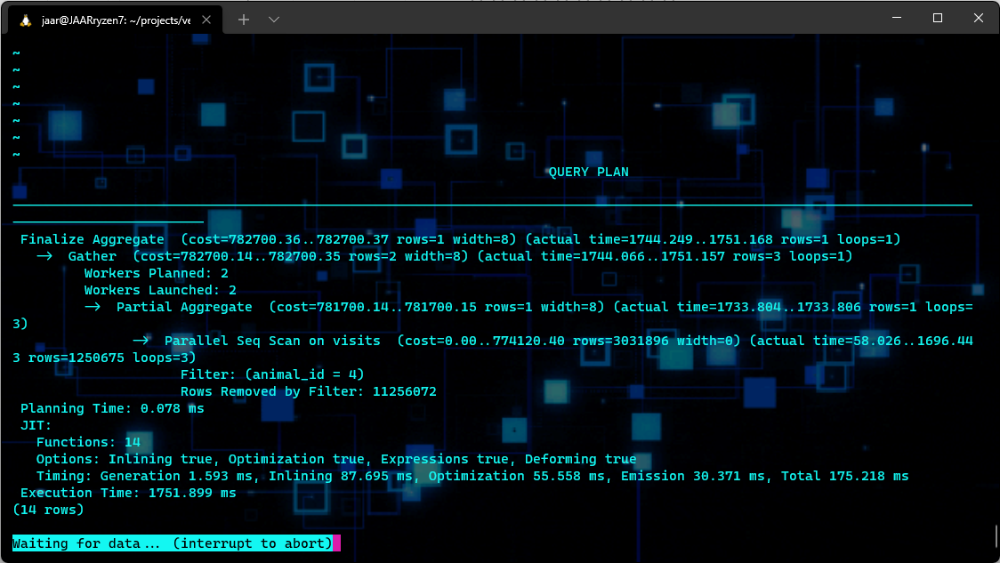
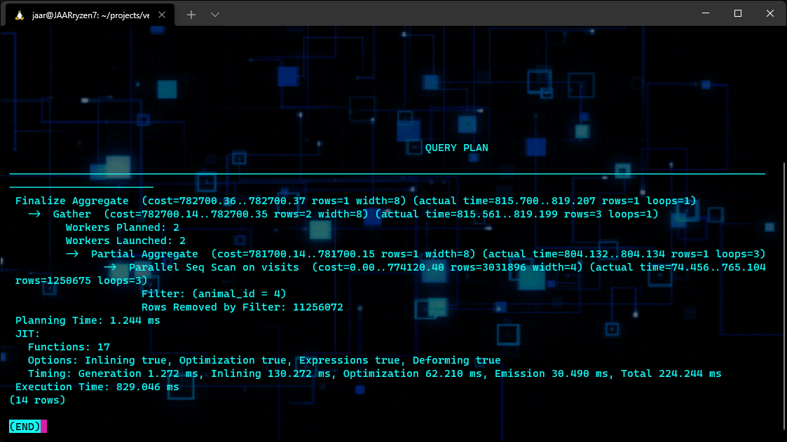
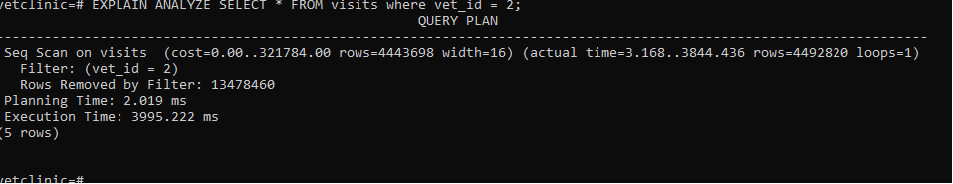
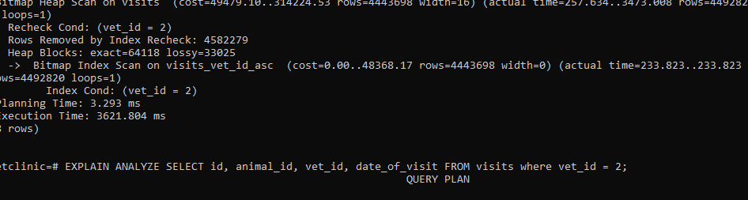
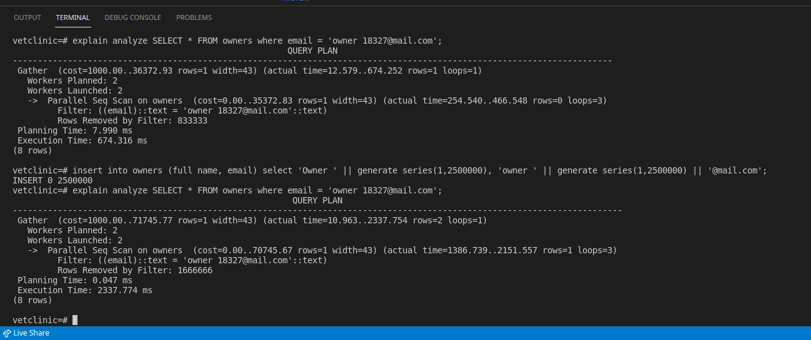
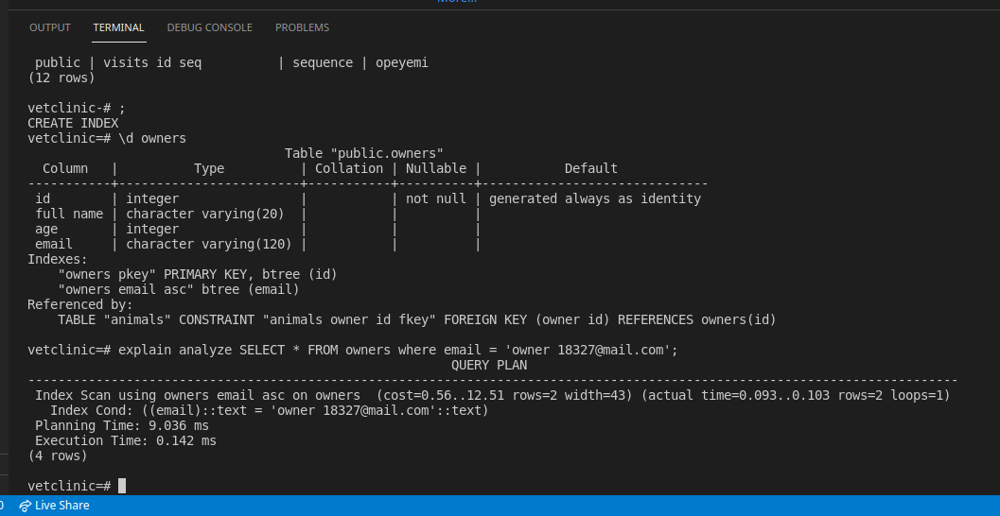

# VET CLINIC DATABASE AUDIT

- This task involved auditing the database of a Vet clinic and improving on the perfomance of some select queries as below.

## Problem 1

### SELECT COUNT(*) FROM visits where animal_id = 4;

<br/>
- Before perfomance tuning <br/>


<br/>
- After perfomance tuning <br/>

### Explanantion of problem and solution

- For the first part we verify the tables and realize that there was no need to modify any of the tables, but we agree that the problem was on the data query itself, so we modify the request to be: 
```
SELECT COUNT(animal_id) FROM visits where animal_id = 4;
```
So the query only takes in cosideration the animal_id colum. 

When we test it out we realize that the execution time was reduce from 1751ms to just 829ms.


## Problem 2

### SELECT * FROM visits where vet_id = 2;

<br/>
- Before perfomance tuning <br/>


<br/>
- After perfomance tuning <br/>

### Explanantion of problem and solution

- For this part we created an index for the column vet_id using:
   ```CREATE INDEX visits_vet_id_asc ON visits(vet_id ASC);```

When we tested it we realized that the execution time reduced from 3995.222 ms to 3621.804 ms

## Problem 3

### SELECT * FROM owners where email = 'owner_18327@mail.com';

<br/>
- Before perfomance tuning <br/>


<br/>
- After perfomance tuning <br/>


### Explanantion of problem and solution

- For thus problem since the query was using the email as the conditional, we created a Non-clustered index on the email column of the owners table.

- It reduced the execution time from 2337.774 ms to 0.142 ms

## Authors

👤 **Opeyemi Oyelesi**

- GitHub: [@AdedayoOpeyemi](https://github.com/AdedayoOpeyemi)
- Twitter: [@Oyelesiopy](https://twitter.com/oyelesiopy)
- LinkedIn: [Opeyemi Oyelesi](https://linkedin.com/in/opeyemioyelesi)

👤 **Jose Alberto Arriaga Ramos** 
- Github: [@jaarkira](https://github.com/jaar91)
- Twitter: [@91_jaar](https://twitter.com/91_jaar)
- Linkedin: [Jose Arriaga](https://www.linkedin.com/in/jaar/)

👤 **Emmanuel Isabirye** 
- Github: [@gEmmanuelaaron](https://github.com/emmanuelaaron)
- Twitter: [@Emmanuel Isabirye](https://twitter.com/EmmanuelIsabir1)
- Linkedin: [Emmanuel Isabirye](https://www.linkedin.com/in/fullstackwebdev-emma/) 


## 🤝 Contributing

Contributions, issues, and feature requests are welcome!

Feel free to check the [issues page](https://github.com/emmanuelaaron/issues).

## Show your support

Give a ⭐️ if you like this project!

## Acknowledgments

- Hat tip to anyone whose code was used
- Inspiration
- etc

## 📝 License

This project is [MIT](./MIT.md) licensed.